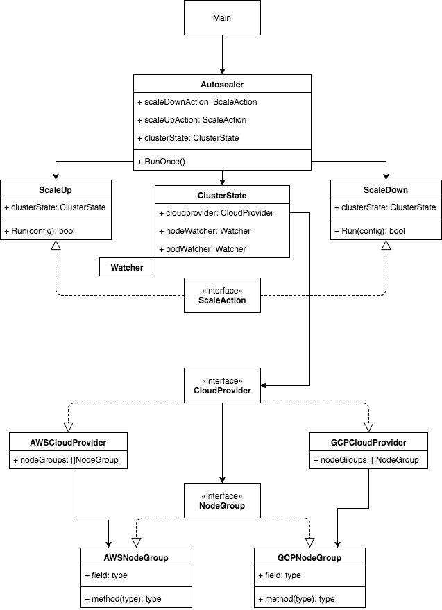

# Documentation

## Packages Layout and Usages

- `cmd`
    - contains command function, setup, and config loading
- `pkg/controller`
    - contains the core logic specific to escalator and nodegroups
- `pkg/k8s`
    - provides application utils and help with interfacing with Kubernetes and client-go
- `pkg/cloudprovider`
    - provides everything related to cloud providers
    - `pkg/cloudprovider/aws`
      - provides the aws implementation of cloudprovider
- `pkg/metrics`
    - provides a place for all metric setup to live
- `pkg/test`
    - provides Kubernetes and cloudprovider helpers for testing

## System Algorithm Design

### Short summary

- The autoscaler is designed as a static autoscaler. 
- Start watching all pods and nodes in the cluster for a certain node group, including pending pods
- Every tick the autoscaler will check the overall cluster utilisation for each node group and make a decision on 
  whether to do nothing, scale up, or scale down.
    - If the scale lock is present
        - Check whether the scale lock has timed out, otherwise do nothing
    - On a scale up event
        - Untaint as many nodes as we need to
        - Increase the ASG size by the remaining nodes
        - Lock the scale lock until ASG resize is complete to prevent infinite scaling
    - On a scale down event
        - Taint the configured amount of nodes so they are unschedulable
        - Wait until the grace period for the node has passed and the node is empty
        - Terminate any nodes that have passed the grace period and are empty

## System Architecture

Basic idea of System Architecture. Subject to change dramatically. Update image when design changes

