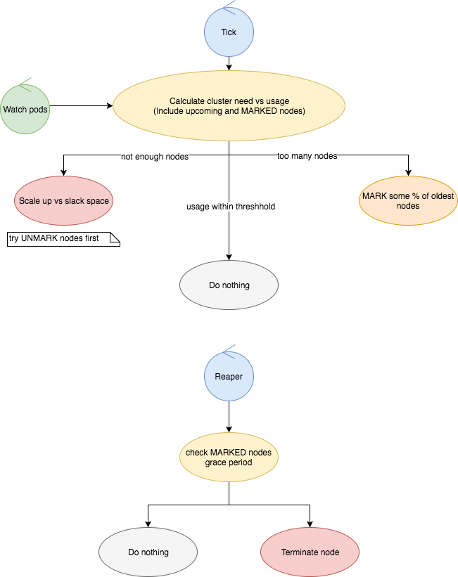

# Documentation

## Contents

- [**Best Practices, Common Issues and Gotchas**](./best-practices-issues-gotchas.md)
    - Best Practices
    - Common Issues and Gotchas
- [**Configuration**](./configuration/README.md)
    - [Command line options](./configuration/command-line.md)
    - [Node Group Configuration](./configuration/nodegroup.md)
    - [Advanced Configuration](./configuration/advanced-configuration.md)
- [**Deployment**](./deployment/README.md)
    - [AWS](./deployment/aws/README.md)
- [**Algorithm and Calculations**](./calculations.md)
    - Assumptions
    - Requests, capacity and utilisation
    - Scale up delta
- [**Scale Process**](./scale-process.md)
    - Scale up
    - Scale down
    - Scale lock
    - Tainting of nodes
    - Cordoning of nodes
- [**Node Termination**](./node-termination.md)
    - Node selection method for termination
    - Annotating nodes / Stopping termination of selected nodes
- [**Pod and Node Selectors**](./pod-node-selectors.md)
    - Nodes
    - Pods
    - Default Pod Selector
    - More Information
- [**Metrics**](./metrics.md)
    - Exposed Metrics
    - Grafana
    - Recommendations
- [**Glossary**](./glossary.md)
        
## Package Layout and Usage

- `cmd`
    - contains command function, setup, and config loading
- `pkg/controller`
    - contains the core logic specific to escalator and nodegroups
- `pkg/k8s`
    - provides application utils and help with interfacing with Kubernetes and client-go
- `pkg/cloudprovider`
    - provides everything related to cloud providers
    - `pkg/cloudprovider/aws`
      - provides the aws implementation of cloudprovider
- `pkg/metrics`
    - provides a place for all metric setup to live
- `pkg/test`
    - provides Kubernetes and cloudprovider helpers for testing

## Design

### Summary

**Full scale up/down process can be found [here](./scale-process.md)**

- The autoscaler is designed as a static autoscaler. 
- Start watching all pods and nodes in the cluster for a certain node group, including pending pods
- Every tick the autoscaler will check the overall cluster utilisation for each node group and make a decision on 
  whether to do nothing, scale up, or scale down:
    - If the scale lock is present
        - Check whether the scale lock has timed out, otherwise do nothing
    - On a scale up event
        - Untaint as many nodes as we need to
        - Increase the ASG size by the remaining nodes
        - Lock the scale lock until ASG resize is complete to prevent infinite scaling
    - On a scale down event
        - Taint the configured amount of nodes so they are unschedulable
        - Wait until the grace period for the node has passed and the node is empty
        - Terminate any nodes that have passed the grace period and are empty
    - On a "do nothing" event
        - Terminate any nodes that have passed the grace period and are empty

