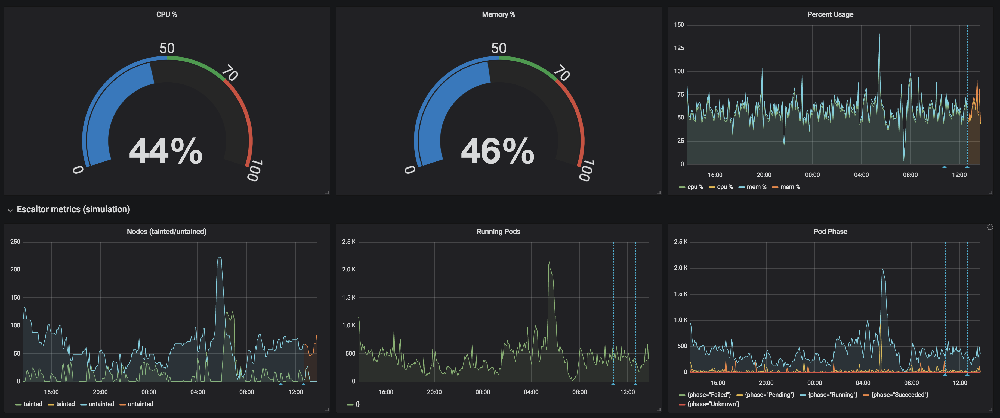

# Metrics

Escalator exposes metrics of scaling, requests, capacity, utilisation, nodes and pods at the `/metrics` endpoint. 
These metrics can be scraped by a monitoring system such as [Prometheus](https://prometheus.io/).

It is highly recommended to collect the metrics exposed by Escalator, as it can provide helpful insight into how
it is operating as well as when you need to debug it's operation.

You can change which address:port combination the `/metrics` endpoint serves at using the `--address` flag. By default
it serves the metrics at `0.0.0.0:8080/metrics`.

## Exposed Metrics

These are the metrics that Escalator exposes, and are subject to change:

### General

 - **`escalator_run_count`**: Number of times the controller has checked for cluster state
 
### Node Group Nodes and Pods
 
 - **`escalator_node_group_untainted_nodes`**: nodes considered by specific node groups that are untainted
 - **`escalator_node_group_tainted_nodes`**: nodes considered by specific node groups that are tainted
 - **`escalator_node_group_cordoned_nodes`**: nodes considered by specific node groups that are cordoned
 - **`escalator_node_group_nodes`**: nodes considered by specific node groups
 - **`escalator_node_group_pods`**: pods considered by specific node groups
 - **`escalator_node_group_pods_evicted`**: pods evicted during a scale down

### Node Group CPU and Memory
 
 - **`escalator_node_group_mem_percent`**: percentage of util of memory
 - **`escalator_node_group_cpu_percent`**: percentage of util of cpu
 - **`escalator_node_group_mem_request`**: byte value of node request mem
 - **`escalator_node_group_cpu_request`**: milli value of node request cpu
 - **`escalator_node_group_mem_capacity`**: byte value of node capacity mem
 - **`escalator_node_group_cpu_capacity`**: milli value of node capacity cpu

### Node Group Scaling

 - **`escalator_node_group_taint_event`**: indicates a scale down event
 - **`escalator_node_group_untaint_event`**: indicates a scale up event
 - **`escalator_node_group_scale_lock`**: indicates if the nodegroup is locked from scaling, zero is asserted unlocked, non-zero postivie locked
 - **`escalator_node_group_scale_delta`**: indicates current scale delta
 - **`escalator_node_group_scale_lock_duration`**: histogram metric of scale lock durations, 60 second buckets from 1 … 30.
 - **`escalator_node_group_scale_lock_check_was_locked`**: counter of how many time the lock status was probed and found locked
 - **`escalator_node_group_node_registration_lag`**: histogram metric of how long nodes take to become registered in kube from cloud provider instantiation, 60 second buckets from 1 … 30
 
### Cloud Provider
 
 - **`escalator_cloud_provider_min_size`**: current cloud provider minimum size
 - **`escalator_cloud_provider_max_size`**: current cloud provider maximum size
 - **`escalator_cloud_provider_target_size`**: current cloud provider target size
 - **`escalator_cloud_provider_size`**: current cloud provider size
 
## Grafana
 
Included is an example dashboard in [`grafana-dashboard.json`](./grafana-dashboard.json) for use within 
[Grafana](https://grafana.com/). It provides an overview of what Escalator is currently doing and what it has done over
time. 
This is exceptionally helpful when debugging issues with scaling up/down as it shows the overall utilisation for the
node group at a specific time or over time.
 
Below is a screenshot of the included dashboard:

 
## Recommendations
 
It is highly recommended to monitor and graph the two utilisation metrics 
(`escalator_node_group_mem_percent` and `escalator_node_group_cpu_percent`) as this will let you see the utilisation that Escalator
calculates. Ideally these values should stay below your scale up threshold.
